#### 1. Load packages

``` r
library(ggplot2)
library(Matrix)
library(cowplot)
library(Seurat)
library(tidyverse)
library(plyr)
library(SingleCellExperiment)
library(matrixStats)
library(umap)
library(foreach)
library(DoubletFinder)
```

#### 2. Load the data

``` r
setwd("~/Documents/Post_Doc/Drop-Seq/10X/Thirst2")
sat00_rep1.raw <- Read10X_h5("DGE/2019JUN_water_G4_rep1_filtered_feature_bc_matrix.h5")
sat00_rep2.raw <- Read10X_h5("DGE/2019JUN_water_G4_rep2_filtered_feature_bc_matrix.h5")
dep06_rep1.raw <- Read10X_h5("DGE/2019JUN_water_G1_rep1_filtered_feature_bc_matrix.h5")
dep06_rep2.raw <- Read10X_h5("DGE/2019JUN_water_G1_rep2_filtered_feature_bc_matrix.h5")
dep12_rep1.raw <- Read10X_h5("DGE/2019JUN_water_G2_rep1_filtered_feature_bc_matrix.h5")
dep12_rep2.raw <- Read10X_h5("DGE/2019JUN_water_G2_rep2_filtered_feature_bc_matrix.h5")
reh00_rep1.raw <- Read10X_h5("DGE/2019JUN_water_G3_rep1_filtered_feature_bc_matrix.h5")
reh00_rep2.raw <- Read10X_h5("DGE/2019JUN_water_G3_rep2_filtered_feature_bc_matrix.h5")
```

#### 3. Create Seurat objects

``` r
sat00_rep1 <- CreateSeuratObject(counts = sat00_rep1.raw, project = "sat00_rep1")
sat00_rep2 <- CreateSeuratObject(counts = sat00_rep2.raw, project = "sat00_rep2")
dep06_rep1 <- CreateSeuratObject(counts = dep06_rep1.raw, project = "dep06_rep1")
dep06_rep2 <- CreateSeuratObject(counts = dep06_rep2.raw, project = "dep06_rep2")
dep12_rep1 <- CreateSeuratObject(counts = dep12_rep1.raw, project = "dep12_rep1")
dep12_rep2 <- CreateSeuratObject(counts = dep12_rep2.raw, project = "dep12_rep2")
reh00_rep1 <- CreateSeuratObject(counts = reh00_rep1.raw, project = "reh00_rep1")
reh00_rep2 <- CreateSeuratObject(counts = reh00_rep2.raw, project = "reh00_rep2")
```

#### 4. Calculate and plot percent of mitochondrial and ribosomal RNA, and ribosomal proteins.

Cells with high level of mitochondrial or ribosomal RNA, or ribosomal
proteins are probably unhealthy, stressed, or dying.

``` r
sat00_rep1[["percent.mt"]] <- PercentageFeatureSet(sat00_rep1, pattern = "^mt:")
sat00_rep2[["percent.mt"]] <- PercentageFeatureSet(sat00_rep2, pattern = "^mt:")
dep06_rep1[["percent.mt"]] <- PercentageFeatureSet(dep06_rep1, pattern = "^mt:")
dep06_rep2[["percent.mt"]] <- PercentageFeatureSet(dep06_rep2, pattern = "^mt:")
dep12_rep1[["percent.mt"]] <- PercentageFeatureSet(dep12_rep1, pattern = "^mt:")
dep12_rep2[["percent.mt"]] <- PercentageFeatureSet(dep12_rep2, pattern = "^mt:")
reh00_rep1[["percent.mt"]] <- PercentageFeatureSet(reh00_rep1, pattern = "^mt:")
reh00_rep2[["percent.mt"]] <- PercentageFeatureSet(reh00_rep2, pattern = "^mt:")

sat00_rep1[["percent.rRNA"]] <- PercentageFeatureSet(sat00_rep1, pattern = "(S|-)rRNA")
sat00_rep2[["percent.rRNA"]] <- PercentageFeatureSet(sat00_rep2, pattern = "(S|-)rRNA")
dep06_rep1[["percent.rRNA"]] <- PercentageFeatureSet(dep06_rep1, pattern = "(S|-)rRNA")
dep06_rep2[["percent.rRNA"]] <- PercentageFeatureSet(dep06_rep2, pattern = "(S|-)rRNA")
dep12_rep1[["percent.rRNA"]] <- PercentageFeatureSet(dep12_rep1, pattern = "(S|-)rRNA")
dep12_rep2[["percent.rRNA"]] <- PercentageFeatureSet(dep12_rep2, pattern = "(S|-)rRNA")
reh00_rep1[["percent.rRNA"]] <- PercentageFeatureSet(reh00_rep1, pattern = "(S|-)rRNA")
reh00_rep2[["percent.rRNA"]] <- PercentageFeatureSet(reh00_rep2, pattern = "(S|-)rRNA")

sat00_rep1[["percent.rProt"]] <- PercentageFeatureSet(sat00_rep1, pattern = "Rp(L|S)")
sat00_rep2[["percent.rProt"]] <- PercentageFeatureSet(sat00_rep2, pattern = "Rp(L|S)")
dep06_rep1[["percent.rProt"]] <- PercentageFeatureSet(dep06_rep1, pattern = "Rp(L|S)")
dep06_rep2[["percent.rProt"]] <- PercentageFeatureSet(dep06_rep2, pattern = "Rp(L|S)")
dep12_rep1[["percent.rProt"]] <- PercentageFeatureSet(dep12_rep1, pattern = "Rp(L|S)")
dep12_rep2[["percent.rProt"]] <- PercentageFeatureSet(dep12_rep2, pattern = "Rp(L|S)")
reh00_rep1[["percent.rProt"]] <- PercentageFeatureSet(reh00_rep1, pattern = "Rp(L|S)")
reh00_rep2[["percent.rProt"]] <- PercentageFeatureSet(reh00_rep2, pattern = "Rp(L|S)")

seurat_list <- list(sat00_rep1, sat00_rep2, dep06_rep1, dep06_rep2, dep12_rep1, dep12_rep2, reh00_rep1, reh00_rep2)
mt_table <- list()
rr_table <- list()
rp_table <- list()
hsp.table <- list()
for(i in seq_along(seurat_list)){
  mt_table[[seurat_list[[i]]@project.name]] <- as.numeric(seurat_list[[i]]$percent.mt)
  rr_table[[seurat_list[[i]]@project.name]] <- as.numeric(seurat_list[[i]]$percent.rRNA)
  rp_table[[seurat_list[[i]]@project.name]] <- as.numeric(seurat_list[[i]]$percent.rProt)
}
mt_table <- data.frame(lapply(mt_table, `length<-`, max(lengths(mt_table))))
rr_table <- data.frame(lapply(rr_table, `length<-`, max(lengths(rr_table))))
rp_table <- data.frame(lapply(rp_table, `length<-`, max(lengths(rp_table))))
```

Plot values, with thresholds

``` r
col_vector <- scale_color_manual(values=rep(c("#4e85c5", "#7e93a2", "#bb9e69", "#b373a6"), each=2))
perc.remove.mito <- 15
perc.remove.rrna <- 10
perc.remove.rprot <- 15

mt_table %>% gather(sample, perc_mito, na.rm=TRUE, factor_key=TRUE) %>% ggplot(aes(x=sample, y=perc_mito)) + labs(x="Samples", y="Percentage of mitochondrial RNA") + geom_jitter(size=.1, aes(colour=sample)) + theme(axis.text.x = element_text(angle=45, hjust=1), legend.position = "none") + geom_boxplot(outlier.size=-1, alpha=0.5) + geom_hline(yintercept=perc.remove.mito, linetype="dashed") + col_vector
```

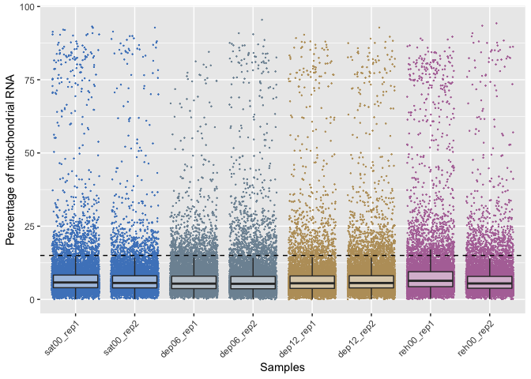

``` r
rr_table %>% gather(sample, perc_rrna, na.rm=TRUE, factor_key=TRUE) %>% ggplot(aes(x=sample, y=perc_rrna)) + labs(x="Samples", y="Percentage of ribosomal RNA") + geom_jitter(size=.1, aes(colour=sample)) + theme(axis.text.x = element_text(angle=45, hjust=1), legend.position = "none") + geom_boxplot(outlier.size=-1, alpha=0.5) + geom_hline(yintercept=perc.remove.rrna, linetype="dashed") + col_vector
```

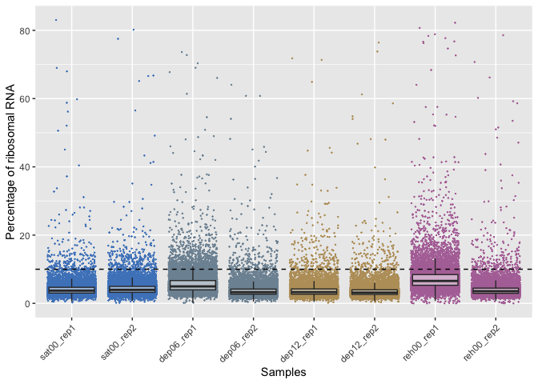

``` r
rp_table %>% gather(sample, perc_rprot, na.rm=TRUE, factor_key=TRUE) %>% ggplot(aes(x=sample, y=perc_rprot)) + labs(x="Samples", y="Percentage of ribosomal proteins") + geom_jitter(size=.1, aes(colour=sample)) + theme(axis.text.x = element_text(angle=45, hjust=1), legend.position = "none") + geom_boxplot(outlier.size=-1, alpha=0.5) + geom_hline(yintercept=perc.remove.rprot, linetype="dashed") + col_vector
```

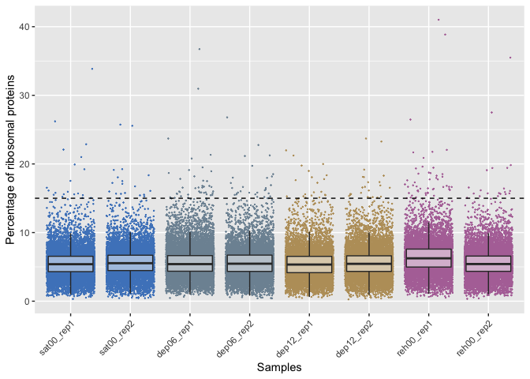

Visualising the relationship between the mitochondrial RNA, ribosomal
RNA and ribosomal proteins.

``` r
mt_table <- mt_table %>% gather(sample, perc_mito, na.rm = TRUE, factor_key=TRUE)
rr_table <- rr_table %>% gather(sample, perc_rrna, na.rm = TRUE, factor_key=TRUE)
rp_table <- rp_table %>% gather(sample, perc_rprot, na.rm = TRUE, factor_key=TRUE)
table <- cbind(mt_table, rr_table[-1], rp_table[-1])
table %>% ggplot(aes(x=perc_mito, y=perc_rrna)) + geom_point(size=.01, aes(colour=sample)) + geom_hline(yintercept=perc.remove.rrna, linetype="dashed") + geom_vline(xintercept=perc.remove.mito, linetype="dashed") + facet_wrap(~sample, nrow=2) + theme(legend.position = "none") + labs(x="Percentage mitochondrial RNA", y="Percentage ribosomal RNA") + col_vector
```

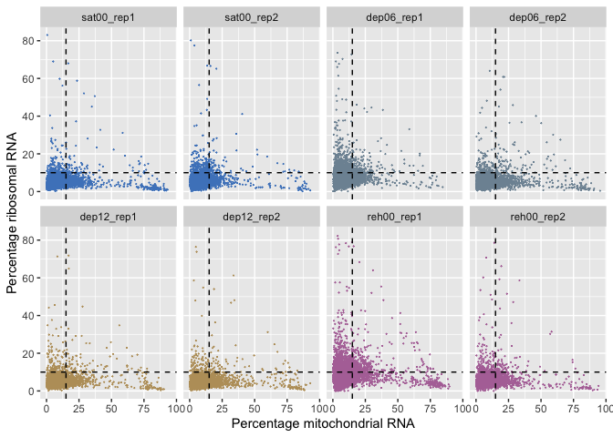

``` r
table %>% ggplot(aes(x=perc_mito, y=perc_rprot)) + geom_point(size=.01, aes(colour=sample)) + geom_hline(yintercept=perc.remove.rprot, linetype="dashed") + geom_vline(xintercept=perc.remove.mito, linetype="dashed") + facet_wrap(~sample, nrow=2) + theme(legend.position = "none") + labs(x="Percentage mitochondrial RNA", y="Percentage ribosomal proteins") + col_vector
```

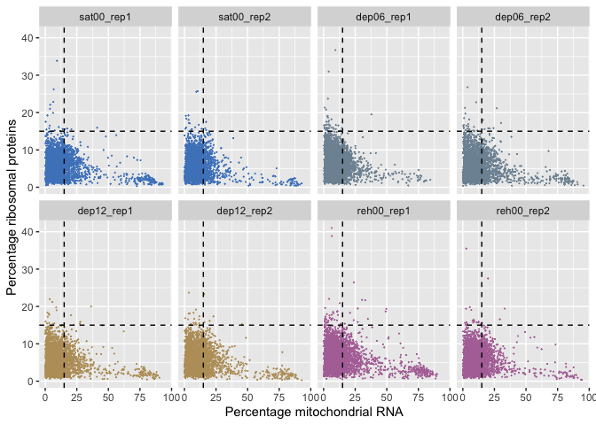

``` r
table %>% ggplot(aes(x=perc_rrna, y=perc_rprot)) + geom_point(size=.01, aes(colour=sample)) + geom_hline(yintercept=perc.remove.rprot, linetype="dashed") + geom_vline(xintercept=perc.remove.rrna, linetype="dashed") + facet_wrap(~sample, nrow=2) + theme(legend.position = "none") + labs(x="Percentage ribosomal RNA", y="Percentage ribosomal proteins") + col_vector
```

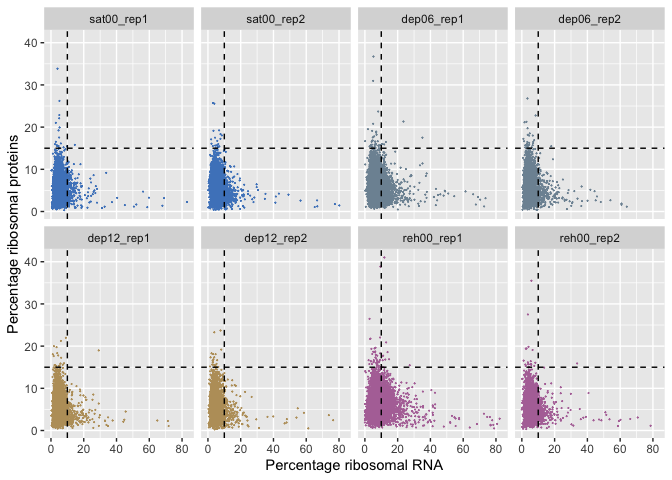

#### 5. Calculate and plot number of features and number of UMIs.

Barcodes with too few features (genes) or UMIs don’t contain enough
information. Barcodes with too many UMIs or genes may be doublets. These
barcodes should be removed.

``` r
num_table <- list()
umi_table <- list()
for(i in seq_along(seurat_list)){
  num_table[[seurat_list[[i]]@project.name]] <- as.numeric(seurat_list[[i]]$nFeature_RNA)
  umi_table[[seurat_list[[i]]@project.name]] <- as.numeric(seurat_list[[i]]$nCount_RNA)
}
num_table <- data.frame(lapply(num_table, `length<-`, max(lengths(num_table)))) %>% as_tibble %>% gather(sample, n_features, na.rm=TRUE, factor_key=TRUE)
umi_table <- data.frame(lapply(umi_table, `length<-`, max(lengths(umi_table)))) %>% as_tibble %>% gather(sample, n_umis, na.rm=TRUE, factor_key=TRUE)

min_features <- 300
max_features <- 4500
max_UMIs <- 25000

num_table %>% ggplot(aes(x=sample, y=n_features)) + labs(x="Samples", y="Number of features") + geom_jitter(size=.1, aes(colour=sample)) + theme(axis.text.x = element_text(angle=45, hjust=1), legend.position = "none") + geom_boxplot(outlier.size=0, alpha=0.5) + geom_hline(yintercept=c(min_features, max_features), linetype="dashed") + col_vector
```

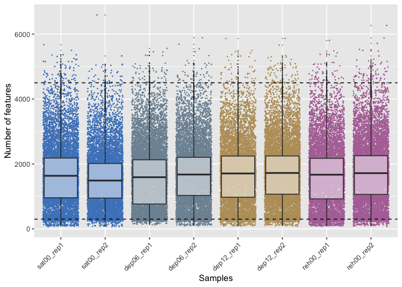

``` r
umi_table %>% ggplot(aes(x=sample, y=n_umis)) + labs(x="Samples", y="Number of UMIs") + geom_jitter(size=.1, aes(colour=sample)) + theme(axis.text.x = element_text(angle=45, hjust=1), legend.position = "none") + geom_boxplot(outlier.size=0, alpha=0.5) + geom_hline(yintercept=c(max_UMIs), linetype="dashed") + col_vector
```

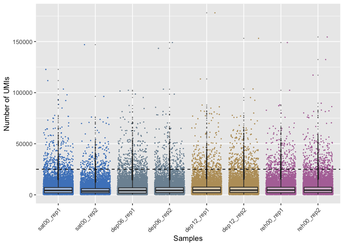

Plot the number of features vs the number of UMIs.

``` r
num_table %>% mutate(n_umis=umi_table$n_umis) %>% ggplot(aes(x=n_umis, y=n_features)) + geom_point(size=.2, aes(colour=sample)) + facet_wrap(~sample, ncol=4) + geom_hline(yintercept=c(min_features, max_features), linetype="dashed") + geom_vline(xintercept=max_UMIs, linetype="dashed") + col_vector + theme(legend.position="none", axis.text.x=element_text(angle=45, hjust=1)) + labs(x="Number of UMIs", y="Number of features")
```

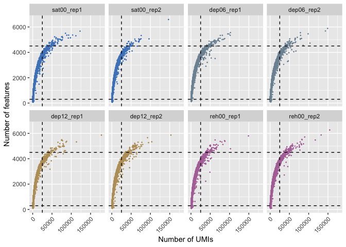

#### 6. Removing outlier cells

Removing cells with at least one of these metrics:  
**\< 300 features**  
**\> 4500 features**  
**\> 25,000 UMIs**  
**\> 15% mt-RNA**  
**\> 10% rRNA**  
**\> 15% ribosomal proteins**

``` r
trim_data <- function(object){
  data_trim <- object %>% subset(subset = nFeature_RNA >= min_features & nFeature_RNA <= max_features & percent.mt < perc.remove.mito & percent.rRNA < perc.remove.rrna & nCount_RNA <= max_UMIs & percent.rProt <= perc.remove.rprot)
  removed <- dim(object)[2] - dim(data_trim)[2]
  perc_removed <- removed/dim(object)[2]*100
  print(paste0("Number of cells removed in ", object@project.name, ": ", removed, " (", round(perc_removed,2), "%)"))
  return(data_trim)
}
sat00_rep1_trim <- sat00_rep1 %>% trim_data()
```

    ## [1] "Number of cells removed in sat00_rep1: 1382 (13.99%)"

``` r
sat00_rep2_trim <- sat00_rep2 %>% trim_data()
```

    ## [1] "Number of cells removed in sat00_rep2: 1062 (11.08%)"

``` r
dep06_rep1_trim <- dep06_rep1 %>% trim_data()
```

    ## [1] "Number of cells removed in dep06_rep1: 2079 (16.99%)"

``` r
dep06_rep2_trim <- dep06_rep2 %>% trim_data()
```

    ## [1] "Number of cells removed in dep06_rep2: 1305 (13.12%)"

``` r
dep12_rep1_trim <- dep12_rep1 %>% trim_data()
```

    ## [1] "Number of cells removed in dep12_rep1: 1227 (14.03%)"

``` r
dep12_rep2_trim <- dep12_rep2 %>% trim_data()
```

    ## [1] "Number of cells removed in dep12_rep2: 1392 (12.56%)"

``` r
reh00_rep1_trim <- reh00_rep1 %>% trim_data()
```

    ## [1] "Number of cells removed in reh00_rep1: 2512 (25.47%)"

``` r
reh00_rep2_trim <- reh00_rep2 %>% trim_data()
```

    ## [1] "Number of cells removed in reh00_rep2: 1362 (12.59%)"

#### 7. Normalise & add sex info

We normalise the data and add the expression level of roX1 to the
metadata so we can regress against this in subsequent analyses.

``` r
thirst_list <- list(sat00_rep1_trim, sat00_rep2_trim, dep06_rep1_trim, dep06_rep2_trim, dep12_rep1_trim, dep12_rep2_trim, reh00_rep1_trim, reh00_rep2_trim)
stim <- rep(conditions, each=2)
for(i in 1:length(thirst_list)){
  thirst_list[[i]]$stim <- stim[i]
  thirst_list[[i]] <- NormalizeData(thirst_list[[i]])
  thirst_list[[i]] <- AddModuleScore(thirst_list[[i]], "lncRNA:roX1", name="sex", seed=123)
}
```

#### 8. Merging Seurat objects

``` r
sat00 <- merge(thirst_list[[1]], thirst_list[[2]], add.cell.ids = c("sat00_rep1", "sat00_rep2"))
dep06 <- merge(thirst_list[[3]], thirst_list[[4]], add.cell.ids = c("dep06_rep1", "dep06_rep2"))
dep12 <- merge(thirst_list[[5]], thirst_list[[6]], add.cell.ids = c("dep12_rep1", "dep12_rep2"))
reh00 <- merge(thirst_list[[7]], thirst_list[[8]], add.cell.ids = c("reh00_rep1", "reh00_rep2"))
```

#### 9. Run SCTransform

``` r
stim_list <- foreach(o=list(sat00, dep06, dep12, reh00)){
  SCTransform(o, vars.to.regress=c("orig.ident", "sex1"), verbose=FALSE)
}
```

#### 10. Integration

Use the ‘anchors’ method from Seurat V3 to integrate all samples
together.

``` r
thirst_features <- SelectIntegrationFeatures(object.list=stim_list, nfeatures=2000)
options(future.globals.maxSize=8*1024*1024^2)
stim_list <- PrepSCTIntegration(object.list=stim_list, anchor.features=thirst_features, verbose=FALSE)
thirst_anchors <- FindIntegrationAnchors(object.list=stim_list, dims = 1:IntegrationPCs, scale=F, normalization.method="SCT", reduction = "cca", anchor.features=thirst_features, verbose=FALSE)
Thirst2_SCT <- IntegrateData(anchorset=thirst_anchors, normalization.method="SCT", verbose=FALSE)
```

#### 11. Clustering

``` r
Thirst2_SCT@active.assay <- "integrated"
Thirst2_SCT <- RunPCA(Thirst2_SCT, npcs=20)
Thirst2_SCT <- RunUMAP(Thirst2_SCT, reduction="pca", dims=1:20, n.neighbors=30)
Thirst2_SCT <- FindNeighbors(Thirst2_SCT, reduction="pca", dims=1:20, k.param=30, force.recalc=TRUE)
Thirst2_SCT <- FindClusters(Thirst2_SCT, resolution=2, graph.name="integrated_snn")
```

``` r
Idents(Thirst2_SCT) <- Thirst2_SCT$seurat_clusters <- Thirst2_SCT$integrated_snn_res.2
DimPlot(Thirst2_SCT, label=T, pt.size=.2) + NoAxes() + theme(legend.position="none")
```

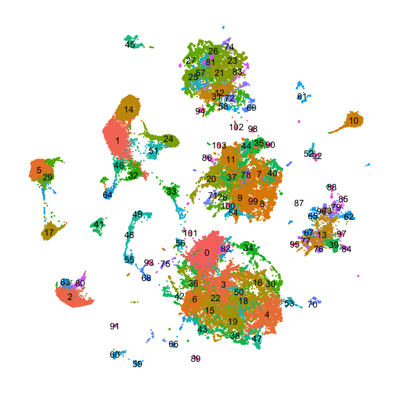

#### 12. DoubletFinder: optimising the number of neighbours (pK).

``` r
seurat_list <- SplitObject(Thirst2_SCT, split.by="orig.ident")
seurat_list <- foreach(s=seurat_list) %do% {
  SCTransform(s, vars.to.regress=c("sex1"), verbose=FALSE)
}
bcmvn_tables_SCT <- foreach(s=seurat_list) %do% {
  sweep.res.list <- paramSweep_v3(s, PCs = 1:20, sct=T)
  sweep.stats <- summarizeSweep(sweep.res.list, GT = FALSE)
  bcmvn <- as_tibble(sweep.stats) %>% group_by(pK) %>% dplyr::summarize(MeanBC=mean(BCreal), VarBC=sd(BCreal)^2, BCmetric=mean(BCreal)/(sd(BCreal)^2))
}
```

Plot mean-variance normalized bimodality coefficient (BCmvn) for each pK
value.

``` r
btables_SCT <- foreach(b=bcmvn_tables_SCT, o=unique(Thirst2_SCT$orig.ident)) %do% {
  b$sample <- o
  return(b)
}
bind_rows(btables_SCT) %>% mutate(pK=as.numeric(pK), sample=factor(sample, levels=unique(sample))) %>% ggplot(aes(x=pK, y=BCmetric)) + geom_point() + geom_line() + facet_wrap(~sample, ncol=4, scales="free_y")
```

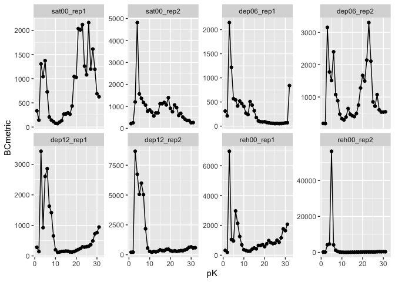

BCmvn values are very different from one sample to another, which might
strongly bias doublet identification.

#### 13. Process data with basic Seurat pipeline (without SCTransform)

``` r
# Scale
object_list <- list(sat00, dep06, dep12, reh00)
for(i in 1:length(object_list)){
  object_list[[i]] <- ScaleData(object_list[[i]], vars.to.regress = c("orig.ident", "nCount_RNA", "sex1"))
}
# Integrate
Thirst2.anchors <- FindIntegrationAnchors(object.list=object_list, dims = 1:IntegrationPCs, scale = F, reduction = "cca", anchor.features = 2000)
Thirst2 <- IntegrateData(anchorset = Thirst2.anchors, dims = 1:IntegrationPCs)
# Cluster
DefaultAssay(Thirst2) <- "integrated"
Thirst2 <- ScaleData(Thirst2, vars.to.regress="sex1")
Thirst2 <- RunPCA(Thirst2, npcs = 20)
Thirst2 <- RunUMAP(Thirst2, reduction="pca", dims=1:20, n.neighbors=30)
Thirst2 <- FindNeighbors(Thirst2, reduction="pca", dims=1:20, k.param=30, force.recalc=TRUE)
Thirst2 <- FindClusters(Thirst2, resolution=2, graph.name="integrated_snn")
```

#### 14. Optimise the number of neighbours (pK) on data processed with basic Seurat pipeline

``` r
seurat_list <- SplitObject(Thirst2, split.by="orig.ident")
seurat_list <- foreach(s=seurat_list) %do% {
  s <- NormalizeData(s)
  s <- ScaleData(s, vars.to.regress=c("nCount_RNA", "sex1"))
  s <- FindVariableFeatures(s)
  RunPCA(s, npcs=PCs, verbose=F)
}
bcmvn_tables <- foreach(s=seurat_list) %do% {
  sweep.res.list <- paramSweep_v3(s, PCs = 1:20)
  sweep.stats <- summarizeSweep(sweep.res.list, GT = FALSE)
  bcmvn <- as.tibble(sweep.stats) %>% group_by(pK) %>% dplyr::summarize(MeanBC=mean(BCreal), VarBC=sd(BCreal)^2, BCmetric=mean(BCreal)/(sd(BCreal)^2))
}
```

``` r
btables <- foreach(b=bcmvn_tables, o=unique(Thirst2$orig.ident)) %do% {
  b$sample <- o
  return(b)
}
bind_rows(btables) %>% mutate(pK=as.numeric(pK), sample=factor(sample, levels=unique(sample))) %>% ggplot(aes(x=pK, y=BCmetric)) + geom_point() + geom_line() + facet_wrap(~sample, ncol=4, scales="free_y")
```

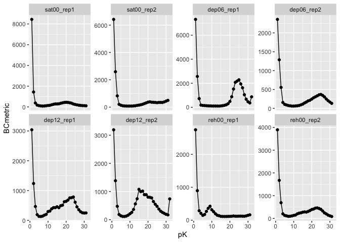

BCmvn values are nuch more homogeneous. We run DoubletFinder on data
processed with the standard Seurat pipeline.

#### 15. Run DoubletFinder

``` r
Thirst2$DF_classification <- "Singlet"
foreach(i=unique(Thirst2$orig.ident), b=bcmvn_tables) %do% {
  object.i <- subset(Thirst2, subset=orig.ident==i)
  object.i <- NormalizeData(object.i)
  object.i <- FindVariableFeatures(object.i)
  object.i <- ScaleData(object.i, vars.to.regress=c("nCount_RNA", "sex1"))
  object.i <- RunPCA(object.i, npcs=PCs, verbose=F)
  homotypic.prop <- modelHomotypic(Idents(object.i))
  nExp_poi <- round(0.05*dim(object.i)[2])
  nExp_poi.adj <- round(nExp_poi*(1-homotypic.prop))
  pK.i <- b %>% filter(BCmetric==max(BCmetric)) %>% pull(pK) %>% as.character() %>% as.double()
  object.i <- doubletFinder_v3(object.i, PCs = 1:20, pN = 0.25, pK = pK.i, nExp = nExp_poi, reuse.pANN = FALSE, sct = FALSE)
  doublet_found <- object.i@meta.data[,grepl("DF.classifications", names(object.i@meta.data))]
  Thirst2$DF_classification[Thirst2$orig.ident==i] <- doublet_found
}
Thirst2@misc$bcmvn_tables <- bcmvn_tables
```

#### 16. Coexpression-based doublet identification

Cells with expression levels above thresholds for each pair of genes are
flagged.

``` r
pairs <- list(c("VAChT", "nrv2"), c("Gad1", "nrv2"), c("VGlut", "nrv2"), c("VAChT", "Gad1"), c("VAChT", "VGlut"), c("Gad1", "VGlut"))
lims <- data.frame(Gene=unlist(pairs), Thresh=c(1.5,3,2.3,3,2.1,3,1.5,2.3,1.5,2.1,2.3,2.1)) %>% mutate(Gene=factor(Gene, levels=unique(unlist(pairs))))
Thirst2_SCT$doublet_ID <- "Singlet"
tick=1
for(j in pairs){
  lim.j <- lims[c(tick,tick+1),]
  doublets_toflag <- names(Thirst2_SCT[,Thirst2_SCT@assays$RNA@data[j[1],] > lim.j[lim.j$Gene==j[1],]$Thresh & Thirst2_SCT@assays$RNA@data[j[2],] > lim.j[lim.j$Gene==j[2],]$Thresh]$nCount_RNA)
  Thirst2_SCT$doublet_ID[doublets_toflag][Thirst2_SCT$doublet_ID[doublets_toflag]!="Singlet"] <- paste(paste(j, collapse=" & "), Thirst2_SCT$doublet_ID[doublets_toflag][Thirst2_SCT$doublet_ID[doublets_toflag]!="Singlet"], sep=" + ")
  Thirst2_SCT$doublet_ID[doublets_toflag][Thirst2_SCT$doublet_ID[doublets_toflag]=="Singlet"] <- paste(j, collapse=" & ")
  tick=tick+2
}
```

#### 17. Coexpression-based doublet identification in Kenyon cells

Isolating and clustering KCs.

``` r
kcmarkers <- AverageExpression(Thirst2_SCT, features=c("ey", "Dop1R2", "mub"), assays="RNA")
Thirst2_KC_SCT <- subset(Thirst2_SCT, idents=kcmarkers$RNA %>% t() %>% as.data.frame() %>% rownames_to_column("cluster") %>% as_tibble() %>% filter(ey>2 & Dop1R2>2 & mub>50) %>% pull(cluster))
DefaultAssay(Thirst2_KC_SCT) <- "RNA"
Thirst2_KC_SCT <- SCTransform(Thirst2_KC_SCT, vars.to.regress=c("sex1", "orig.ident"), verbose=FALSE)
Thirst2_KC_SCT <- RunPCA(Thirst2_KC_SCT, npcs=PCs)
Thirst2_KC_SCT <- FindNeighbors(Thirst2_KC_SCT, reduction = "pca", dims = 1:10)
Thirst2_KC_SCT <- FindClusters(object = Thirst2_KC_SCT, resolution = 1, save.ssn = T)
Thirst2_KC_SCT <- RunUMAP(Thirst2_KC_SCT, reduction = "pca", dims = 1:10)
```

Cells with expression levels above thresholds for each pair of genes are
flagged.

``` r
pairsKC <- list(c("Ca-alpha1T", "ab"), c("Ca-alpha1T", "CG8641"), c("ab", "CG8641"))
limsKC <- data.frame(Gene=unlist(pairsKC), Thresh=c(1.5,1.5,1.5,2.2,1.5,2.2)) %>% mutate(Gene=factor(Gene, levels=unique(unlist(pairsKC))))
Thirst2_KC_SCT$KC_doublets <- "Singlet"
tick=1
for(j in pairsKC){
  lim.j <- limsKC[c(tick,tick+1),]
  doublets_toflag <- names(Thirst2_KC_SCT[,Thirst2_KC_SCT@assays$RNA@data[j[1],] > lim.j[lim.j$Gene==j[1],]$Thresh & Thirst2_KC_SCT@assays$RNA@data[j[2],] > lim.j[lim.j$Gene==j[2],]$Thresh]$nCount_RNA)
  Thirst2_KC_SCT$KC_doublets[doublets_toflag][Thirst2_KC_SCT$KC_doublets[doublets_toflag]!="Singlet"] <- paste(paste(j, collapse=" & "), Thirst2_KC_SCT$KC_doublets[doublets_toflag][Thirst2_KC_SCT$KC_doublets[doublets_toflag]!="Singlet"], sep=" + ")
  Thirst2_KC_SCT$KC_doublets[doublets_toflag][Thirst2_KC_SCT$KC_doublets[doublets_toflag]=="Singlet"] <- paste(j, collapse=" & ")
  tick=tick+2
}
```

Visualising the doublets

``` r
doublet_table <- as_tibble(Thirst2_KC_SCT@reductions$umap@cell.embeddings[,1:2]) %>% mutate(DF=Thirst2_KC_SCT$KC_doublets, sample=Thirst2_KC_SCT$orig.ident) %>% unite(DF_sample, DF:sample, remove=F) %>% mutate(DF_sample=factor(DF_sample, levels=unique(DF_sample)), sample=factor(sample, levels=unique(sample)))
doublet_table %>% filter(DF=="Singlet") %>% ggplot(aes(x=UMAP_1, y=UMAP_2)) + geom_point(size=1.5, color="lightsteelblue2") + geom_point(data=doublet_table %>% filter(DF!="Singlet") %>% sample_frac(), size=1.5, aes(color=sample)) + theme_void() + theme(legend.title=element_blank()) + guides(colour=guide_legend(override.aes=list(size=5))) + col_vector
```

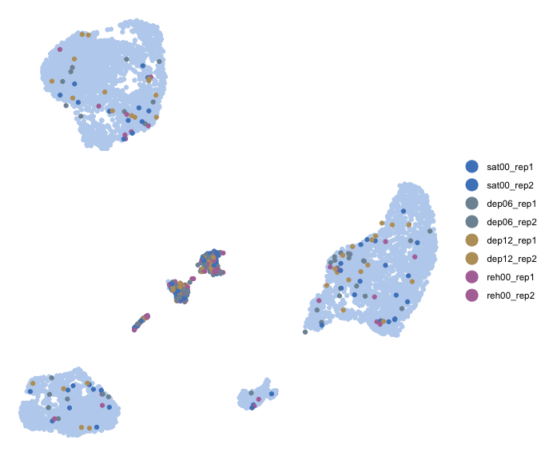

Flagging all cells in the 3 clusters in the middle as they contain many
doublets.

``` r
Thirst2_KC_SCT$KC_doublets[WhichCells(Thirst2_KC_SCT, idents=c(14,15,17))] <- "Mixed_cluster"
Thirst2_SCT$KC_doublets <- "Singlet"
Thirst2_SCT$KC_doublets[colnames(Thirst2_SCT) %in% colnames(Thirst2_KC_SCT)] <- Thirst2_KC_SCT$KC_doublets
```

#### 18. Remove doublets

Visualise all doublets

``` r
doublet_table <- as_tibble(Thirst2_SCT@reductions$umap@cell.embeddings) %>% mutate(Doublets=paste(Thirst2_SCT$doublet_ID, Thirst2_SCT$DF_classification_original, Thirst2_SCT$KC_doublets, sep=" + "), Cluster=Idents(Thirst2_SCT), orig.ident=as.factor(Thirst2_SCT$orig.ident)) %>% mutate(Doublets=str_replace(Doublets, "(Singlet \\+ )|( \\+ Singlet)", ""), Doublets=str_replace(Doublets, "(Singlet \\+ )|( \\+ Singlet)", "")) %>% mutate(Doublets=str_replace(Doublets, "Doublet", "DoubletFinder")) %>% mutate(Doublets=factor(Doublets, levels=unique(Doublets)))
doublet_table %>% mutate(Doublets=case_when(grepl("(+ DoubletFinder)|(DoubletFinder +)", Doublets) ~ "Coexpression +\nDoubletFinder", grepl("&", Doublets)|Doublets=="Mixed_cluster" ~ "Coexpression", TRUE ~ as.character(Doublets))) %>% mutate(Doublets=factor(Doublets, levels=c("Singlet", "DoubletFinder", "Coexpression", "Coexpression +\nDoubletFinder"))) %>% arrange(Doublets) %>% ggplot(aes(x=UMAP_1, y=UMAP_2, color=Doublets)) + geom_point(size=.2) + theme_void() + theme(legend.title=element_blank()) + guides(colour=guide_legend(override.aes=list(size=3), ncol=1)) + scale_color_manual(values=c("lightsteelblue2", "orange", "purple", "black"))
```

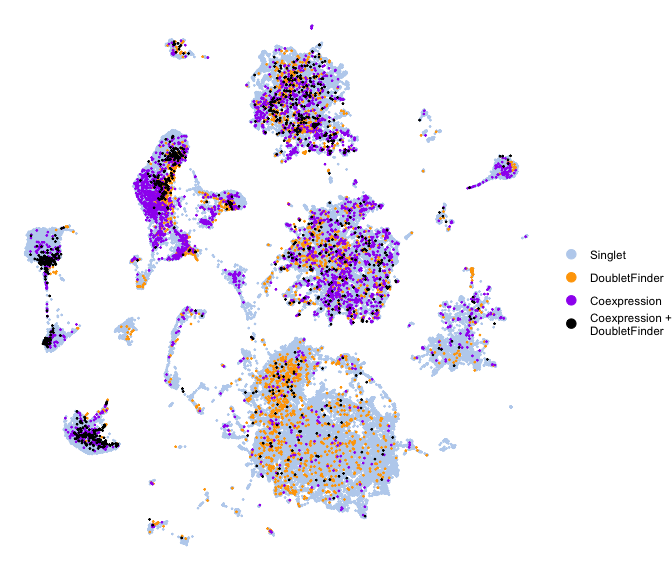

``` r
Thirst2_SCT_trimPlus <- Thirst2_SCT[, doublet_table$Doublets=="Singlet" & Thirst2_SCT$doublet_ratio<.5]
cat("Number of doublets removed:", dim(Thirst2_SCT)[2]-dim(Thirst2_SCT_trimPlus)[2])
```

    ## Number of doublets removed: 6321

``` r
save(Thirst2_SCT_trimPlus, file="Thirst2_SCT_trimPlus.Robj")
```

------------------------------------------------------------------------
