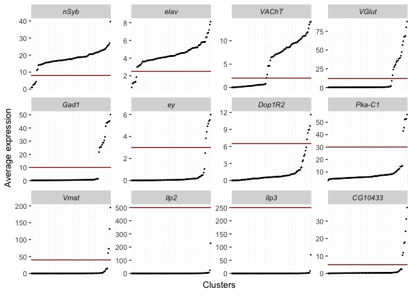
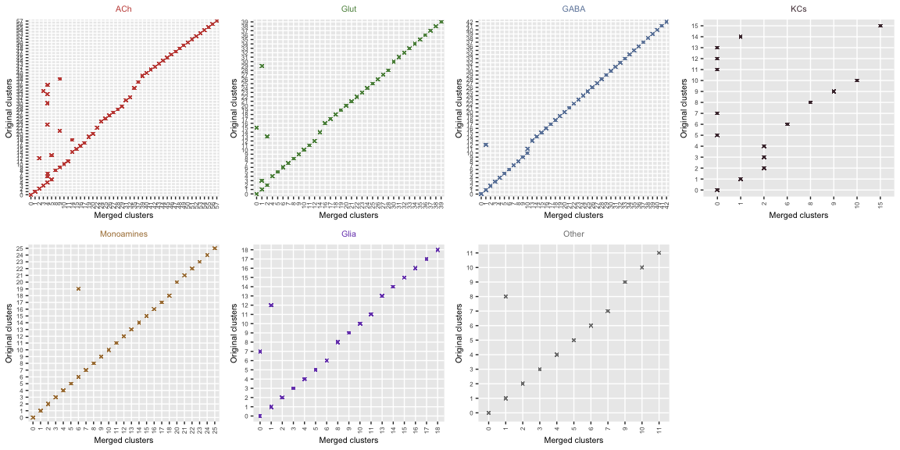

#### 1. Load packages and data

``` r
library(ggplot2)
library(Matrix)
library(cowplot)
library(Seurat)
library(tidyverse)
library(plyr)
library(SingleCellExperiment)
library(matrixStats)
library(umap)
library(foreach)
library(DoubletFinder)
load("Thirst2_SCT_trimPlus.Robj")
```

#### 2. Clustering all data

``` r
# PCA
DefaultAssay(Thirst2_SCT_trimPlus) <- "integrated"
Thirst2_SCT_trimPlus <- RunPCA(Thirst2_SCT_trimPlus, npcs = 20)
# Clustering & UMAP
Thirst2_SCT_trimPlus <- FindNeighbors(Thirst2_SCT_trimPlus, reduction="pca", dims=1:20, k.param=30)
Thirst2_SCT_trimPlus <- FindClusters(Thirst2_SCT_trimPlus, resolution=2, graph.name="integrated_snn")
Thirst2_SCT_trimPlus <- RunUMAP(Thirst2_SCT_trimPlus, reduction="pca", dims=1:20, n.neighbors=30)
```

#### 3. Assign clusters to major cell group

Markers used:  
- Neurons: *nSyb*, *elav* - Cholinergic neurons: *VAChT*  
- Glutamatergic neurons: *VGlut*  
- GABAergic neurons: *Gad1*  
- Kenyon Cells: *ey*, *Dop1R2*, *Pka-C1*  
- Monoaminergic: *Vmat*  
- IPCs: *Ilp2*, *Ilp3*  
- Glia & astrocytes: *CG10433*

``` r
markers <- c("nSyb", "elav", "VAChT", "VGlut", "Gad1", "ey", "Dop1R2", "Pka-C1", "Vmat", "Ilp2", "Ilp3", "CG10433")
markers_avex <- AverageExpression(Thirst2_SCT_trimPlus, assays="RNA", features=markers)$RNA %>% rownames_to_column("Gene") %>% gather(Clusters, Avex, -Gene)
```

``` r
thresholds <- data.frame(Gene=factor(markers, levels=markers), thresh=c(8,2.5,2,12,10,3,6.5,30,40,500,250,5))
markers_avex %>% arrange(Gene, Avex) %>% unite("gene_clusters", Gene, Clusters, sep = "_", remove = FALSE) %>% mutate(gene_clusters=factor(gene_clusters, levels=gene_clusters), Gene=factor(Gene, levels=markers)) %>% ggplot(aes(x=gene_clusters,y=Avex)) + geom_point(size=.2) + facet_wrap(~Gene, scales="free", nrow=3) + theme(strip.text=element_text(face="italic"), axis.ticks.x=element_blank(), axis.text.x = element_blank()) + labs(x="Clusters", y="Average expression") + coord_cartesian(clip = "off") + geom_hline(data=thresholds, aes(yintercept=thresh), color="darkred")
```



``` r
thresholds <- thresholds %>% spread(Gene, thresh)
cellgroups <- list()
markers_values <- markers_avex %>% spread(Gene, Avex)
cellgroups$neurons <- markers_values %>% filter(nSyb>=thresholds$nSyb & elav>=thresholds$elav) %>% pull(Clusters)
cellgroups$cholinergic <- markers_values %>% filter(VAChT>=thresholds$VAChT) %>% pull(Clusters)
cellgroups$glutamatergic <- markers_values %>% filter(VGlut>=thresholds$VGlut) %>% pull(Clusters)
cellgroups$gabaergic <- markers_values %>% filter(Gad1>=thresholds$Gad1) %>% pull(Clusters)
cellgroups$kenyon <- markers_values %>% filter(ey>=thresholds$ey & Dop1R2>=thresholds$Dop1R2 & `Pka-C1`>=thresholds$`Pka-C1`) %>% pull(Clusters)
cellgroups$monoaminergic <- markers_values %>% filter(Vmat>=thresholds$Vmat) %>% pull(Clusters)
cellgroups$IPCs <- markers_values %>% filter(Ilp2>=thresholds$Ilp2 & Ilp3>=thresholds$Ilp3) %>% pull(Clusters)
cellgroups$glia <- markers_values %>% filter(CG10433>=thresholds$CG10433) %>% pull(Clusters)
```

``` r
ann_clusters <- as.character(Idents(Thirst2_SCT_trimPlus))
CT <- rep("Other", length(ann_clusters))
for(i in unique(ann_clusters)){
  if(i %in% cellgroups$glia & !i %in% cellgroups$neurons){
    CT[ann_clusters==i] <- "Glia"
  } else if(i %in% cellgroups$neurons & !i %in% cellgroups$glia){
    if(i %in% cellgroups$cholinergic & !i %in% c(cellgroups$glutamatergic, cellgroups$gabaergic, cellgroups$monoaminergic, cellgroups$IPCs)){
      if(i %in% cellgroups$kenyon){
        CT[ann_clusters==i] <- "KCs"
      } else {
        CT[ann_clusters==i] <- "ACh"
      }
    } else if(i %in% cellgroups$glutamatergic & !i %in% c(cellgroups$cholinergic, cellgroups$gabaergic, cellgroups$monoaminergic, cellgroups$IPCs)){
      CT[ann_clusters==i] <- "Glut"
    } else if(i %in% cellgroups$gabaergic & !i %in% c(cellgroups$cholinergic, cellgroups$glutamatergic, cellgroups$monoaminergic, cellgroups$IPCs)){
      CT[ann_clusters==i] <- "GABA"
    } else if(i %in% cellgroups$monoaminergic & !i %in% c(cellgroups$cholinergic, cellgroups$gabaergic, cellgroups$glutamatergic, cellgroups$IPCs)){
      CT[ann_clusters==i] <- "Monoamines"
    } 
  }
}
Thirst2_SCT_trimPlus$celltype <- CT
```

#### 4. Re-cluster major cell groups

``` r
celltypes <- SplitObject(Thirst2_SCT_trimPlus, split.by="celltype")[c(5,1,3,4,7,2,6)]
PCs <- c(19,17,16,12,16,14,12)
resolutions <- c(1,1,1,1,4,1,2)
Thirst2_celltypes <- foreach(c=celltypes, n=names(celltypes), p=PCs, r=resolutions) %do% {
  c@project.name <- n
  c <- SCTransform(c, vars.to.regress=c("orig.ident", "sex1"), verbose=FALSE)
  c <- RunPCA(c, npcs = p)
  c <- FindNeighbors(c, reduction = "pca", dims = 1:p)
  c <- FindClusters(c, resolution = r, save.ssn=T)
  c <- RunUMAP(c, reduction = "pca", dims = 1:p)
}
```

#### 5. Merge similar clusters

A phylogenetic tree of all clusters is generated with BuildClusterTtree,
then neighbouring clusters with less than 10 protein-coding genes
significantly differently expressed (adjusted p-value \< 0.05) with
logFC ≥ 1 between them are merged.

``` r
Thirst2_celltypes <- foreach(c=Thirst2_celltypes, p=PCs) %do% {
  
  # Build and process tree
  c <- BuildClusterTree(c, dims=1:p, assay="integrated")
  phylo_table <- as_tibble(c@tools$BuildClusterTree$edge) %>% mutate(lengths=c@tools$BuildClusterTree$edge.length, Cluster=V2-1)
  
  # Merge clusters
  c$merged_clusters <- Idents(c)
  nclust_orig <- length(levels(c))
  lim_n_sig <- 10
  full <- FALSE
  clear <- c()
  round <- 1
  while(full==FALSE){
    full <- TRUE
    i <- 1
    while(i<nrow(phylo_table)){
      if(phylo_table[i,]$V2<=nclust_orig & phylo_table[i+1,]$V2<=nclust_orig & phylo_table[i,]$V1==phylo_table[i+1,]$V1 & !phylo_table[i,]$Cluster %in% clear){
        markers_i <- FindMarkers(c, phylo_table[i,]$Cluster, phylo_table[i+1,]$Cluster, assay="RNA", min.pct=.25)
        n_sig <- markers_i %>% rownames_to_column("Gene") %>% dplyr::filter(abs(avg_logFC)>=1, p_val_adj<.05, !grepl("(lncRNA|tRNA|^mt:|rRNA)", Gene)) %>% dplyr::summarise(n()) %>% pull()
        if(n_sig<lim_n_sig){
          min_clus <- min(c(phylo_table[i,]$Cluster, phylo_table[i+1,]$Cluster))
          other_clus <- max(c(phylo_table[i,]$Cluster, phylo_table[i+1,]$Cluster))
          c$merged_clusters[c$merged_clusters==other_clus] <- min_clus
          phylo_table[i-1,] <- t(c(phylo_table[i-1,]$V1, min_clus+1, sum(phylo_table[c(i,i-1),]$lengths), min_clus))
          phylo_table <- phylo_table[-c(i,i+1),]
          full <- FALSE
          i=i-1
        } else{
          clear <- c(clear, phylo_table[i,]$Cluster, phylo_table[i+1,]$Cluster)
        }
      }
      i=i+1
    }
    round=round+1
  }
  c@tools$phylo_table <- phylo_table
  c
}
```

``` r
Thirst2_celltypes <- foreach(c=Thirst2_celltypes) %do% {
  Idents(c) <- c$merged_clusters
  c
}
```

Show merged clusters

``` r
cols <- c("#c64d44","#5d904c","#6d85a9","#4b333c","#ab7f43","#7848bb","grey50")
merged_plots <- foreach(c=Thirst2_celltypes, r=resolutions, cc=cols) %do% {
  tibble(seurat_clusters=as_vector(c@meta.data[paste0("SCT_snn_res.",r)]), merged_clusters=c$merged_clusters) %>% ggplot(aes(x=merged_clusters, y=seurat_clusters)) + geom_point(shape=4, color=cc, size=1) + labs(x="Merged clusters", y="Original clusters") + theme(axis.text.x=element_text(angle=90, hjust=1, vjust=.5), axis.text=element_text(size=6), plot.title=element_text(size=8, hjust=.5, color=cc), axis.title=element_text(size=8)) + ggtitle(c@project.name)
}
plot_grid(plotlist=merged_plots, ncol=4)
```



------------------------------------------------------------------------
