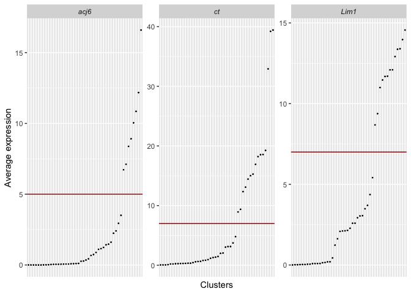
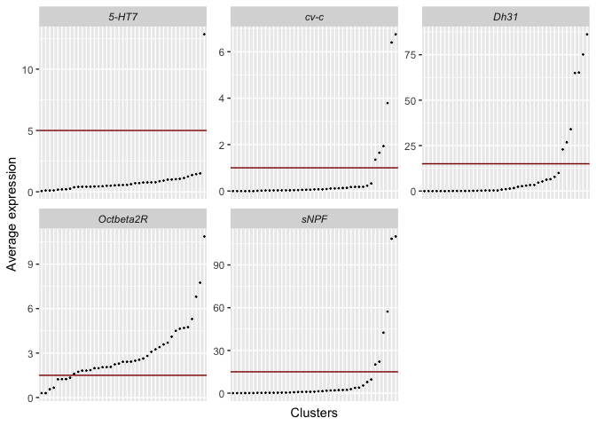
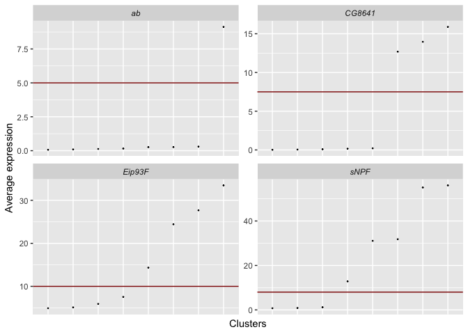
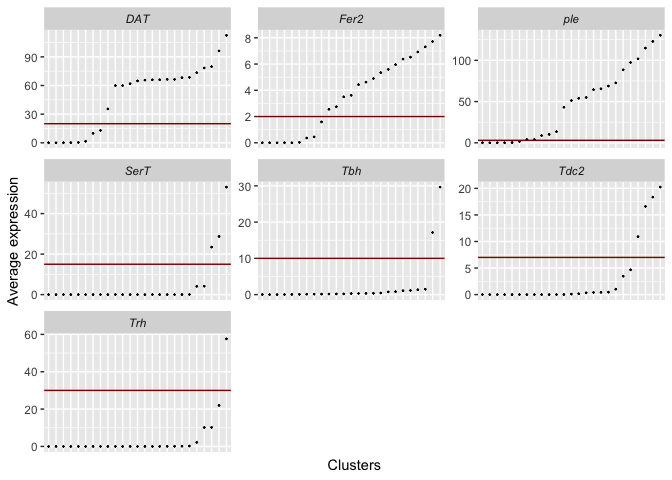
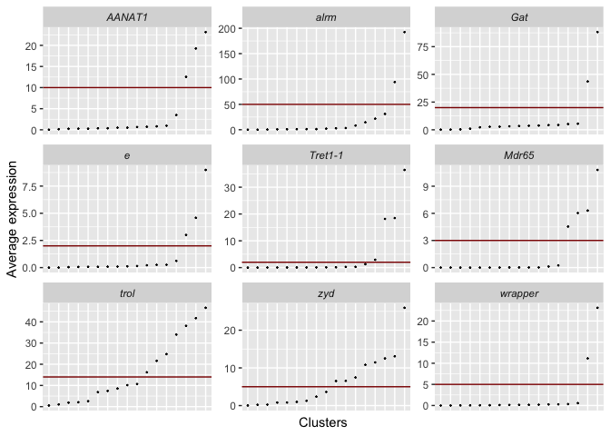
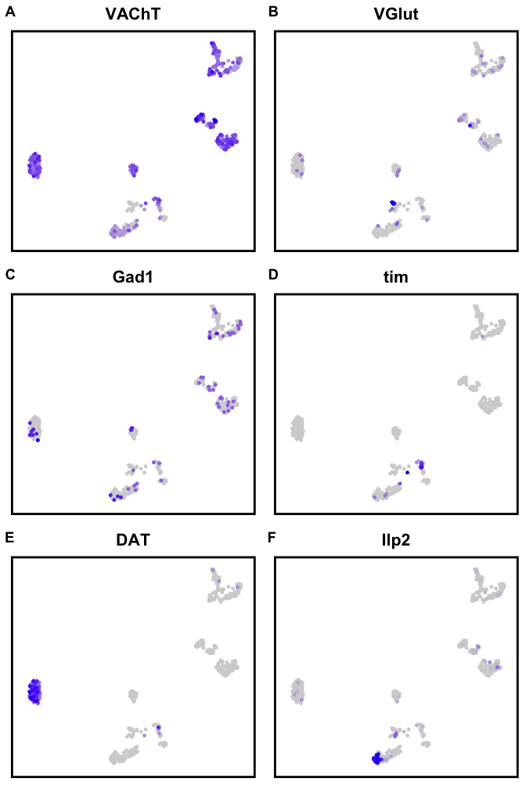

Annotation is done independently for each major cell group, using known
markers from the literature.

#### 1. Load packages and data

``` r
library(ggplot2)
library(Matrix)
library(cowplot)
library(Seurat)
library(tidyverse)
library(plyr)
library(SingleCellExperiment)
library(matrixStats)
library(umap)
library(foreach)
library(DoubletFinder)
load("Thirst2_celltypes.Robj")
load("Thirst2_SCT_trimPlus.Robj")
```

#### 2. Cholinergic neurons

*acj6*, *ct* and *Lim1* are specifically expressed in cholinergic
olfactory projection neurons.

``` r
ACh_markers <- c("ct", "acj6", "Lim1")
ACh_thresholds <- data.frame(Gene=ACh_markers, thresh=c(7,5,7))
for(c in Thirst2_celltypes){if(c@project.name=="ACh"){ACh_object <- c; Idents(ACh_object) <- ACh_object$merged_clusters}}
ACh_markers_table <- as.data.frame(ACh_object@assays$RNA@data[ACh_markers,]) %>% rownames_to_column("Gene") %>% gather(Cells, Values, -Gene) %>% mutate(Gene=factor(Gene, levels=unique(Gene)))
ACh_markers_avex <- AverageExpression(ACh_object, assays="RNA", features=ACh_markers)$RNA %>% rownames_to_column("Gene") %>% gather(Clusters, Avex, -Gene)
ACh_markers_avex %>% arrange(Gene, Avex) %>% unite("gene_clusters", Gene, Clusters, sep = "_", remove = FALSE) %>% mutate(gene_clusters=factor(gene_clusters, levels=gene_clusters), Gene=factor(Gene, levels=ACh_markers)) %>% ggplot(aes(x=gene_clusters,y=Avex)) + geom_point(size=.2) + facet_wrap(~Gene, scales="free") + theme(strip.text=element_text(face="italic"), axis.ticks.x=element_blank(), axis.text.x = element_blank()) + labs(x="Clusters", y="Average expression") + coord_cartesian(clip = "off") + geom_hline(data=ACh_thresholds, aes(yintercept=thresh), color="darkred")
```



Clusters with these 3 genes expressed above threshold are annotated as
olfactory PNs.

``` r
Idents(ACh_object) <- ACh_object$merged_clusters
ACh_object$ann_clusters_sub <- as.character(Idents(ACh_object))
for(i in unique(ACh_object$ann_clusters_sub)){
  if(min(ACh_markers_avex[ACh_markers_avex$Clusters==i,]$Avex>ACh_thresholds$thresh)==1){
    ACh_object$ann_clusters_sub[ACh_object$ann_clusters_sub==i] <- paste0(i, "_OlfactoryPNs")
  } else{
    ACh_object$ann_clusters_sub[ACh_object$ann_clusters_sub==i] <- paste0(i, "_ACh")
  }
}
Idents(ACh_object) <- ACh_object$ann_clusters_sub
```

#### 3. Glutamatergic neurons

``` r
for(c in Thirst2_celltypes){if(c@project.name=="Glut"){Glut_object <- c; Idents(Glut_object) <- Glut_object$merged_clusters}}
Idents(Glut_object) <- Glut_object$merged_clusters
Glut_object$ann_clusters_sub <- paste0(Idents(Glut_object), "_Glut")
Idents(Glut_object) <- Glut_object$ann_clusters_sub
```

#### 4. GABAergic neurons

Markers used:  
Large-field Ellipsoid Body Ring neurons: *cv-c*, *Dh31*, *Octbeta2R*,
*5-HT7*  
Small-field Ellipsoid Body Ring neurons: *cv-c*, *Dh31*, *Octbeta2R*,
NOT *5-HT7*  
Ventral and dorsal fan-shaped body: *cv-c*, *Dh31*, *sNPF*, NOT
*Octbeta2R*  
Medial fan-shaped body: *cv-c*, *Dh31*, NOT *sNPF*, NOT *Octbeta2R*

``` r
GABA_markers <- c("cv-c", "Dh31", "sNPF", "Octbeta2R", "5-HT7")
GABA_thresholds <- data.frame(Gene=GABA_markers, thresh=c(1,15,15,1.5,5))
for(c in Thirst2_celltypes){if(c@project.name=="GABA"){GABA_object <- c; Idents(GABA_object) <- GABA_object$merged_clusters}}
GABA_markers_table <- as.data.frame(GABA_object@assays$RNA@data[GABA_markers,]) %>% rownames_to_column("Gene") %>% gather(Cells, Values, -Gene) %>% mutate(Gene=factor(Gene, levels=unique(Gene)))
GABA_markers_avex <- AverageExpression(GABA_object, assays="RNA", features=GABA_markers)$RNA %>% rownames_to_column("Gene") %>% gather(Clusters, Avex, -Gene)
GABA_markers_avex %>% arrange(Gene, Avex) %>% unite("gene_clusters", Gene, Clusters, sep = "_", remove = FALSE) %>% mutate(gene_clusters=factor(gene_clusters, levels=gene_clusters), Gene=factor(Gene, levels=GABA_markers)) %>% ggplot(aes(x=gene_clusters,y=Avex)) + geom_point(size=.2) + facet_wrap(~Gene, scales="free") + theme(strip.text=element_text(face="italic"), axis.ticks.x=element_blank(), axis.text.x = element_blank()) + labs(x="Clusters", y="Average expression") + coord_cartesian(clip = "off") + geom_hline(data=GABA_thresholds, aes(yintercept=thresh), color="darkred")
```



``` r
Idents(GABA_object) <- GABA_object$merged_clusters
GABA_object$ann_clusters_sub <- as.character(Idents(GABA_object))
for(i in unique(GABA_object$ann_clusters_sub)){
  if(min(GABA_markers_avex[GABA_markers_avex$Clusters==i & GABA_markers_avex$Gene %in% c("cv-c", "Dh31"),]$Avex >= GABA_thresholds[GABA_thresholds$Gene %in% c("cv-c", "Dh31"),]$thresh)==1){
    if(GABA_markers_avex[GABA_markers_avex$Clusters==i & GABA_markers_avex$Gene=="Octbeta2R",]$Avex >= GABA_thresholds[GABA_thresholds$Gene=="Octbeta2R",]$thresh){
      if(GABA_markers_avex[GABA_markers_avex$Clusters==i & GABA_markers_avex$Gene=="5-HT7",]$Avex >= GABA_thresholds[GABA_thresholds$Gene=="5-HT7",]$thresh){
        GABA_object$ann_clusters_sub[GABA_object$ann_clusters_sub==i] <- paste0(i, "_LF-EB")
      } else {
        GABA_object$ann_clusters_sub[GABA_object$ann_clusters_sub==i] <- paste0(i, "_SF-EB")
      }
    } else if (GABA_markers_avex[GABA_markers_avex$Clusters==i & GABA_markers_avex$Gene=="sNPF",]$Avex >= GABA_thresholds[GABA_thresholds$Gene=="sNPF",]$thresh){
      GABA_object$ann_clusters_sub[GABA_object$ann_clusters_sub==i] <- paste0(i, "_dFB/vFB")
    } else {
      GABA_object$ann_clusters_sub[GABA_object$ann_clusters_sub==i] <- paste0(i, "_mFB")
    }
  } else {
    GABA_object$ann_clusters_sub[GABA_object$ann_clusters_sub==i] <- paste0(i, "_GABA")
  }
}
Idents(GABA_object) <- GABA_object$ann_clusters_sub
```

#### 5. Kenyon Cells

Markers used:  
alpha/beta: *sNPF*, *Eip93F*  
gamma: *sNPF*, *ab*  
alpha’/beta’: *CG8641*

``` r
KC_markers <- c("sNPF", "Eip93F", "ab", "CG8641")
KC_thresholds <- data.frame(Gene=KC_markers, thresh=c(8,10,5,7.5))
for(c in Thirst2_celltypes){if(c@project.name=="KCs"){KC_object <- c; Idents(KC_object) <- KC_object$merged_clusters}}
KC_markers_table <- as.data.frame(KC_object@assays$RNA@data[KC_markers,]) %>% rownames_to_column("Gene") %>% gather(Cells, Values, -Gene) %>% mutate(Gene=factor(Gene, levels=unique(Gene)))
KC_markers_avex <- AverageExpression(KC_object, assays="RNA", features=KC_markers)$RNA %>% rownames_to_column("Gene") %>% gather(Clusters, Avex, -Gene)
KC_markers_avex %>% arrange(Gene, Avex) %>% unite("gene_clusters", Gene, Clusters, sep = "_", remove = FALSE) %>% mutate(gene_clusters=factor(gene_clusters, levels=gene_clusters), Gene=factor(Gene, levels=KC_markers)) %>% ggplot(aes(x=gene_clusters,y=Avex)) + geom_point(size=.2) + facet_wrap(~Gene, scales="free") + theme(strip.text=element_text(face="italic"), axis.ticks.x=element_blank(), axis.text.x = element_blank()) + labs(x="Clusters", y="Average expression") + coord_cartesian(clip = "off") + geom_hline(data=KC_thresholds, aes(yintercept=thresh), color="darkred")
```



``` r
Idents(KC_object) <- KC_object$merged_clusters
KC_object$ann_clusters_sub <- as.character(Idents(KC_object))
for(i in unique(KC_object$ann_clusters_sub)){
  if(min(KC_markers_avex[KC_markers_avex$Clusters==i & KC_markers_avex$Gene %in% c("sNPF", "Eip93F"),]$Avex >= KC_thresholds[KC_thresholds$Gene %in% c("sNPF", "Eip93F"),]$thresh)==1){
    KC_object$ann_clusters_sub[KC_object$ann_clusters_sub==i] <- paste0(i, "_abKCs")
  } else if (min(KC_markers_avex[KC_markers_avex$Clusters==i & KC_markers_avex$Gene %in% c("sNPF", "ab"),]$Avex >= KC_thresholds[KC_thresholds$Gene %in% c("sNPF", "ab"),]$thresh)==1){
    KC_object$ann_clusters_sub[KC_object$ann_clusters_sub==i] <- paste0(i, "_yKCs")
  } else if (KC_markers_avex[KC_markers_avex$Clusters==i & KC_markers_avex$Gene=="CG8641",]$Avex >= KC_thresholds[KC_thresholds$Gene=="CG8641",]$thresh){
    KC_object$ann_clusters_sub[KC_object$ann_clusters_sub==i] <- paste0(i, "_primeKCs")
  } else {
    KC_object$ann_clusters_sub[KC_object$ann_clusters_sub==i] <- paste0(i, "_KCs")
  }
}
Idents(KC_object) <- KC_object$ann_clusters_sub
```

#### 6. Monoaminergic neurons

Markers used:  
Dopamine: *ple*, *DAT*  
PAM dopaminergic neurons: *ple*, *DAT*, *Fer2*  
Serotonin: *SerT*, *Trh*  
Octopamine: *Tdc2*, *Tbh*  
Tyramine: *Tdc2*, NOT *Tbh*

``` r
MA_markers <- c("ple", "DAT", "Fer2", "SerT", "Trh", "Tdc2", "Tbh")
MA_thresholds <- data.frame(Gene=MA_markers, thresh=c(3,20,2,15,30,7,10))
for(c in Thirst2_celltypes){if(c@project.name=="Monoamines"){MA_object <- c; Idents(MA_object) <- MA_object$merged_clusters}}
MA_markers_table <- as.data.frame(MA_object@assays$RNA@data[MA_markers,]) %>% rownames_to_column("Gene") %>% gather(Cells, Values, -Gene) %>% mutate(Gene=factor(Gene, levels=unique(Gene)))
MA_markers_avex <- AverageExpression(MA_object, assays="RNA", features=MA_markers)$RNA %>% rownames_to_column("Gene") %>% gather(Clusters, Avex, -Gene)
MA_markers_avex %>% arrange(Gene, Avex) %>% unite("gene_clusters", Gene, Clusters, sep = "_", remove = FALSE) %>% mutate(gene_clusters=factor(gene_clusters, levels=gene_clusters), Gene=factor(Gene, levels=MA_markers)) %>% ggplot(aes(x=gene_clusters,y=Avex)) + geom_point(size=.2) + facet_wrap(~Gene, scales="free") + theme(strip.text=element_text(face="italic"), axis.ticks.x=element_blank(), axis.text.x = element_blank()) + labs(x="Clusters", y="Average expression") + coord_cartesian(clip = "off") + geom_hline(data=MA_thresholds, aes(yintercept=thresh), color="darkred")
```



``` r
Idents(MA_object) <- MA_object$merged_clusters
MA_object$ann_clusters_sub <- as.character(Idents(MA_object))
for(i in unique(MA_object$ann_clusters_sub)){
  if(min(MA_markers_avex[MA_markers_avex$Clusters==i & MA_markers_avex$Gene %in% c("ple", "DAT"),]$Avex >= MA_thresholds[MA_thresholds$Gene %in% c("ple", "DAT"),]$thresh)==1){
    if(MA_markers_avex[MA_markers_avex$Clusters==i & MA_markers_avex$Gene=="Fer2",]$Avex >= MA_thresholds[MA_thresholds$Gene=="Fer2",]$thresh){
      MA_object$ann_clusters_sub[MA_object$ann_clusters_sub==i] <- paste0(i, "_DA-PAM")
    } else {
      MA_object$ann_clusters_sub[MA_object$ann_clusters_sub==i] <- paste0(i, "_DA")
    }
  } else if (min(MA_markers_avex[MA_markers_avex$Clusters==i & MA_markers_avex$Gene %in% c("SerT", "Trh"),]$Avex >= MA_thresholds[MA_thresholds$Gene %in% c("SerT", "Trh"),]$thresh)==1){
    MA_object$ann_clusters_sub[MA_object$ann_clusters_sub==i] <- paste0(i, "_5HT")
  } else if (MA_markers_avex[MA_markers_avex$Clusters==i & MA_markers_avex$Gene=="Tdc2",]$Avex >= MA_thresholds[MA_thresholds$Gene=="Tdc2",]$thresh){
    if(MA_markers_avex[MA_markers_avex$Clusters==i & MA_markers_avex$Gene=="Tbh",]$Avex >= MA_thresholds[MA_thresholds$Gene=="Tbh",]$thresh){
      MA_object$ann_clusters_sub[MA_object$ann_clusters_sub==i] <- paste0(i, "_OA")
    } else {
      MA_object$ann_clusters_sub[MA_object$ann_clusters_sub==i] <- paste0(i, "_TA")
    }
  } else {
    MA_object$ann_clusters_sub[MA_object$ann_clusters_sub==i] <- paste0(i, "_MA_Other")
  }
}
Idents(MA_object) <- MA_object$ann_clusters_sub
```

#### 7. Glia

Markers used:  
Astrocytes-like: *AANAT1*  
Astrocytes: *AANAT1*, *alrm*, *Gat*, *e*  
Surface glia: *Tret1-1*, *Mdr65*  
Ensheathing glia: *zyd*, *trol*  
Cortex glia: *zyd*, *wrapper*

``` r
Glia_markers <- c("AANAT1", "alrm", "Gat", "e", "Tret1-1", "Mdr65", "trol", "zyd", "wrapper")
Glia_thresholds <- data.frame(Gene=Glia_markers, thresh=c(10,50,20,2,2,3,14,5,5))
for(c in Thirst2_celltypes){if(c@project.name=="Glia"){Glia_object <- c; Idents(Glia_object) <- Glia_object$merged_clusters}}
Glia_markers_table <- as.data.frame(Glia_object@assays$RNA@data[Glia_markers,]) %>% rownames_to_column("Gene") %>% gather(Cells, Values, -Gene) %>% mutate(Gene=factor(Gene, levels=unique(Gene)))
Glia_markers_avex <- AverageExpression(Glia_object, assays="RNA", features=Glia_markers)$RNA %>% rownames_to_column("Gene") %>% gather(Clusters, Avex, -Gene)
Glia_markers_avex %>% arrange(Gene, Avex) %>% unite("gene_clusters", Gene, Clusters, sep = "_", remove = FALSE) %>% mutate(gene_clusters=factor(gene_clusters, levels=gene_clusters), Gene=factor(Gene, levels=Glia_markers)) %>% ggplot(aes(x=gene_clusters,y=Avex)) + geom_point(size=.2) + facet_wrap(~Gene, scales="free") + theme(strip.text=element_text(face="italic"), axis.ticks.x=element_blank(), axis.text.x = element_blank()) + labs(x="Clusters", y="Average expression") + coord_cartesian(clip = "off") + geom_hline(data=Glia_thresholds %>% mutate(Gene=factor(Gene, levels=Glia_markers)), aes(yintercept=thresh), color="darkred")
```



``` r
Idents(Glia_object) <- Glia_object$merged_clusters
Glia_object$ann_clusters_sub <- as.character(Idents(Glia_object))
for(i in unique(Glia_object$ann_clusters_sub)){
  if(Glia_markers_avex[Glia_markers_avex$Clusters==i & Glia_markers_avex$Gene=="AANAT1",]$Avex >= Glia_thresholds[Glia_thresholds$Gene=="AANAT1",]$thresh){
    if(min(Glia_markers_avex[Glia_markers_avex$Clusters==i & Glia_markers_avex$Gene %in% c("alrm", "Gat", "e"),]$Avex >= Glia_thresholds[Glia_thresholds$Gene %in% c("alrm", "Gat", "e"),]$thresh)==1){
      Glia_object$ann_clusters_sub[Glia_object$ann_clusters_sub==i] <- paste0(i, "_Astrocytes")
    } else {
      Glia_object$ann_clusters_sub[Glia_object$ann_clusters_sub==i] <- paste0(i, "_Astrocytes-like")
    }
  } else if (min(Glia_markers_avex[Glia_markers_avex$Clusters==i & Glia_markers_avex$Gene %in% c("Tret1-1", "Mdr65"),]$Avex >= Glia_thresholds[Glia_thresholds$Gene %in% c("Tret1-1", "Mdr65"),]$thresh)==1){
    Glia_object$ann_clusters_sub[Glia_object$ann_clusters_sub==i] <- paste0(i, "_SurfaceGlia")
  } else if (Glia_markers_avex[Glia_markers_avex$Clusters==i & Glia_markers_avex$Gene=="zyd",]$Avex >= Glia_thresholds[Glia_thresholds$Gene=="zyd",]$thresh & Glia_markers_avex[Glia_markers_avex$Clusters==i & Glia_markers_avex$Gene=="wrapper",]$Avex >= Glia_thresholds[Glia_thresholds$Gene=="wrapper",]$thresh){
    Glia_object$ann_clusters_sub[Glia_object$ann_clusters_sub==i] <- paste0(i, "_CortexGlia")
  } else if (Glia_markers_avex[Glia_markers_avex$Clusters==i & Glia_markers_avex$Gene=="zyd",]$Avex >= Glia_thresholds[Glia_thresholds$Gene=="zyd",]$thresh & Glia_markers_avex[Glia_markers_avex$Clusters==i & Glia_markers_avex$Gene=="trol",]$Avex >= Glia_thresholds[Glia_thresholds$Gene=="trol",]$thresh){
    Glia_object$ann_clusters_sub[Glia_object$ann_clusters_sub==i] <- paste0(i, "_EnsheathingGlia")
  } else {
    Glia_object$ann_clusters_sub[Glia_object$ann_clusters_sub==i] <- paste0(i, "_GliaOther")
  }
}
Idents(Glia_object) <- Glia_object$ann_clusters_sub
```

#### 8. Other cells

Plotting expression of known genes.

``` r
for(c in Thirst2_celltypes){if(c@project.name=="Other"){Other_object <- c}}
p1 <- FeaturePlot(Other_object, "VAChT", order=T) + NoAxes() + NoLegend() + ggtitle("VAChT") + theme(plot.title=element_text(hjust=.5), panel.border=element_rect(colour="black", size=2))
p2 <- FeaturePlot(Other_object, "VGlut", order=T) + NoAxes() + NoLegend() + ggtitle("VGlut") + theme(plot.title=element_text(hjust=.5), panel.border=element_rect(colour="black", size=2))
p3 <- FeaturePlot(Other_object, "Gad1", order=T) + NoAxes() + NoLegend() + ggtitle("Gad1") + theme(plot.title=element_text(hjust=.5), panel.border=element_rect(colour="black", size=2))
p4 <- FeaturePlot(Other_object, "tim", order=T) + NoAxes() + NoLegend() + ggtitle("tim") + theme(plot.title=element_text(hjust=.5), panel.border=element_rect(colour="black", size=2))
p5 <- FeaturePlot(Other_object, "DAT", order=T) + NoAxes() + NoLegend() + ggtitle("DAT") + theme(plot.title=element_text(hjust=.5), panel.border=element_rect(colour="black", size=2))
p6 <- FeaturePlot(Other_object, "Ilp2", order=T) + NoAxes() + NoLegend() + ggtitle("Ilp2") + theme(plot.title=element_text(hjust=.5), panel.border=element_rect(colour="black", size=2))
plot_grid(p1,p2,p3,p4,p5,p6, ncol=2, labels="AUTO")
```



Searching for markers specific to each cluster

``` r
other_markers <- FindAllMarkers(Other_object, min.diff.pct=.25, logfc.threshold=.5, only.pos=T)
print(other_markers %>% group_by(cluster) %>% dplyr::slice(1:5), n=1e3)
```

    ## # A tibble: 55 x 7
    ## # Groups:   cluster [11]
    ##       p_val avg_logFC pct.1 pct.2 p_val_adj cluster         gene     
    ##       <dbl>     <dbl> <dbl> <dbl>     <dbl> <fct>           <chr>    
    ##  1 1.20e-31     1.26  0.976 0.168  8.87e-28 4_OtherNeurons  Imp      
    ##  2 4.16e-31     1.06  0.927 0.161  3.09e-27 4_OtherNeurons  Nep1     
    ##  3 1.30e-30     0.540 0.39  0.009  9.62e-27 4_OtherNeurons  CG10970  
    ##  4 1.12e-29     1.10  0.902 0.165  8.32e-26 4_OtherNeurons  CrebA    
    ##  5 2.65e-29     0.612 0.317 0.002  1.97e-25 4_OtherNeurons  Ets21C   
    ##  6 2.89e-69     1.89  0.842 0.009  2.14e-65 10_ClockNeurons vri      
    ##  7 6.66e-49     0.791 0.526 0.002  4.94e-45 10_ClockNeurons Clk      
    ##  8 5.18e-48     1.48  0.737 0.018  3.84e-44 10_ClockNeurons tim      
    ##  9 1.53e-44     2.91  0.526 0.004  1.14e-40 10_ClockNeurons CG17777  
    ## 10 2.14e-42     1.50  1     0.067  1.59e-38 10_ClockNeurons CG13054  
    ## 11 1.05e-58     1.16  0.727 0.014  7.77e-55 6_Other-ACh     Hmx      
    ## 12 1.29e-44     0.749 0.697 0.028  9.61e-41 6_Other-ACh     ey       
    ## 13 9.12e-27     1.56  0.758 0.097  6.77e-23 6_Other-ACh     twz      
    ## 14 9.06e-21     0.958 0.818 0.172  6.72e-17 6_Other-ACh     haf      
    ## 15 9.82e-20     0.973 1     0.290  7.29e-16 6_Other-ACh     pdm3     
    ## 16 2.16e-22     1.51  0.679 0.078  1.60e-18 9_Other-ACh     CG7191   
    ## 17 1.76e-21     1.15  0.964 0.17   1.30e-17 9_Other-ACh     dve      
    ## 18 1.33e-20     0.878 0.821 0.149  9.84e-17 9_Other-ACh     Ptx1     
    ## 19 1.98e-20     1.16  0.929 0.241  1.47e-16 9_Other-ACh     DIP-gamma
    ## 20 4.81e-20     0.822 0.964 0.183  3.57e-16 9_Other-ACh     fkh      
    ## 21 7.18e-90     2.26  0.935 0.01   5.33e-86 0_Other-ACh-DA  ple      
    ## 22 3.42e-84     2.59  0.987 0.041  2.53e-80 0_Other-ACh-DA  Vmat     
    ## 23 3.42e-84     1.69  0.883 0.008  2.54e-80 0_Other-ACh-DA  Ets65A   
    ## 24 1.33e-71     1.56  0.805 0.018  9.90e-68 0_Other-ACh-DA  DAT      
    ## 25 3.16e-68     2.39  0.974 0.106  2.34e-64 0_Other-ACh-DA  ct       
    ## 26 6.59e-36     1.09  0.694 0.054  4.89e-32 5_Other-ACh     rn       
    ## 27 9.94e-29     1.07  0.778 0.105  7.38e-25 5_Other-ACh     zld      
    ## 28 3.68e-28     0.951 0.972 0.168  2.73e-24 5_Other-ACh     fkh      
    ## 29 1.31e-27     0.600 0.556 0.042  9.71e-24 5_Other-ACh     Scgdelta 
    ## 30 1.68e-22     1.01  0.917 0.222  1.24e-18 5_Other-ACh     bab2     
    ## 31 4.74e-24     6.26  0.558 0.083  3.51e-20 2_IPCs          Ilp2     
    ## 32 3.04e-22     5.49  0.442 0.049  2.25e-18 2_IPCs          Ilp3     
    ## 33 1.10e-21     5.52  0.442 0.051  8.15e-18 2_IPCs          Ilp5     
    ## 34 2.05e-20     1.11  0.865 0.289  1.52e-16 2_IPCs          CG42394  
    ## 35 7.79e-15     1.34  0.942 0.624  5.78e-11 2_IPCs          Fas2     
    ## 36 4.01e-49     1.61  0.667 0.024  2.98e-45 3_Other-ACh     Lgr3     
    ## 37 1.24e-42     0.550 0.452 0.002  9.17e-39 3_Other-ACh     qsm      
    ## 38 1.08e-38     0.811 0.762 0.064  8.01e-35 3_Other-ACh     shg      
    ## 39 2.92e-37     1.37  1     0.14   2.17e-33 3_Other-ACh     dve      
    ## 40 1.28e-35     0.737 0.381 0.002  9.53e-32 3_Other-ACh     CG17177  
    ## 41 3.02e-39     1.03  0.714 0.097  2.24e-35 1_Other-ACh     Oct-TyrR 
    ## 42 2.17e-37     0.562 0.418 0.003  1.61e-33 1_Other-ACh     B-H2     
    ## 43 5.83e-33     0.774 0.615 0.072  4.33e-29 1_Other-ACh     foxo     
    ## 44 1.38e-28     0.883 0.736 0.177  1.02e-24 1_Other-ACh     zfh2     
    ## 45 4.85e-28     0.869 0.78  0.206  3.60e-24 1_Other-ACh     vvl      
    ## 46 1.92e-56     1.65  0.742 0.018  1.42e-52 7_Other-ACh     Vsx2     
    ## 47 3.61e-39     0.604 0.419 0.002  2.68e-35 7_Other-ACh     erm      
    ## 48 1.24e-31     1.38  0.871 0.111  9.20e-28 7_Other-ACh     toy      
    ## 49 1.54e-31     0.937 0.677 0.051  1.14e-27 7_Other-ACh     Sox102F  
    ## 50 3.60e-29     0.693 0.419 0.012  2.67e-25 7_Other-ACh     SP1029   
    ## 51 1.08e-58     0.580 0.571 0      8.00e-55 11_OtherNeurons CG6055   
    ## 52 1.18e-52     1.18  0.714 0.009  8.76e-49 11_OtherNeurons sog      
    ## 53 3.21e-46     2.40  0.929 0.033  2.38e-42 11_OtherNeurons CG14401  
    ## 54 1.96e-45     0.608 0.643 0.009  1.46e-41 11_OtherNeurons CG34325  
    ## 55 8.48e-44     1.82  0.929 0.036  6.29e-40 11_OtherNeurons CG9336

Most clusters express cholinergic markers, although they often express
markers for other cell types, which is why they were not included in the
main cholinergic cell group.  
Cluster 0 co-expresses cholinergic and dopaminergic markers so is named
‘Other-ACh-DA’.  
Cluster 2 expresses Insulin-like peptides *Ilp2* and *Ilp3* which are
markers of Insulin Producing Cells (‘IPCs’).  
Cluster 10 expresses members of the circadian clock, such as *Clk*,
*cry* and *tim*.

``` r
Idents(Other_object) <- Other_object$merged_clusters
Other_object$ann_clusters_sub <- as.character(Idents(Other_object))
Other_object$ann_clusters_sub[Other_object$ann_clusters_sub==0] <- "0_Other-ACh-DA"
Other_object$ann_clusters_sub[Other_object$ann_clusters_sub==1] <- "1_Other-ACh"
Other_object$ann_clusters_sub[Other_object$ann_clusters_sub==2] <- "2_IPCs"
Other_object$ann_clusters_sub[Other_object$ann_clusters_sub==3] <- "3_Other-ACh"
Other_object$ann_clusters_sub[Other_object$ann_clusters_sub==4] <- "4_OtherNeurons"
Other_object$ann_clusters_sub[Other_object$ann_clusters_sub==5] <- "5_Other-ACh"
Other_object$ann_clusters_sub[Other_object$ann_clusters_sub==6] <- "6_Other-ACh"
Other_object$ann_clusters_sub[Other_object$ann_clusters_sub==7] <- "7_Other-ACh"
Other_object$ann_clusters_sub[Other_object$ann_clusters_sub==9] <- "9_Other-ACh"
Other_object$ann_clusters_sub[Other_object$ann_clusters_sub==10] <- "10_ClockNeurons"
Other_object$ann_clusters_sub[Other_object$ann_clusters_sub==11] <- "11_OtherNeurons"
Idents(Other_object) <- Other_object$ann_clusters_sub
```

#### 9. Integration into original object

``` r
Thirst2_SCT_trimPlus$celltype_ann <- NA
for(o in c(ACh_object, Glut_object, GABA_object, KC_object, MA_object, Glia_object, Other_object)){
  Thirst2_SCT_trimPlus$celltype_ann[rownames(Thirst2_SCT_trimPlus@meta.data) %in% rownames(o@meta.data)] <- o$ann_clusters_sub
}
Idents(Thirst2_SCT_trimPlus) <- Thirst2_SCT_trimPlus$celltype_ann
Thirst2_SCT_trimPlus$celltype_ann <- factor(Thirst2_SCT_trimPlus$celltype_ann, levels=unique(Thirst2_SCT_trimPlus@meta.data[order(Thirst2_SCT_trimPlus$celltype),]$celltype_ann))
```

------------------------------------------------------------------------
